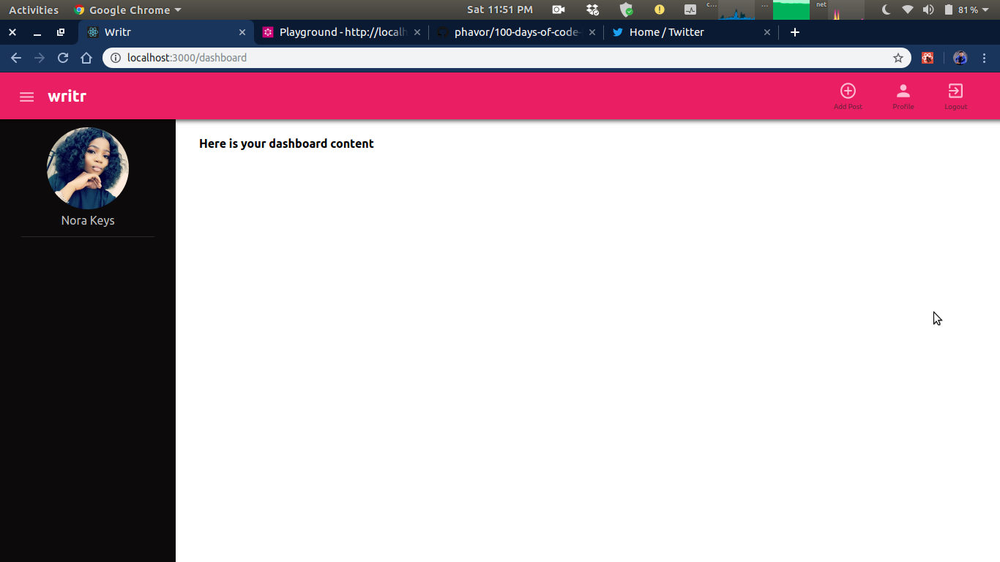

# #100daysofcode

## UpScaling is a go...Round II

### Day1 August 7, Wednesday

**Today's Work**: Setting up apollo-graphql server for a large scale application

**Thoughts**: What can I build with this setup? maybe a microservice

**Link to work**: Apollo Docs

### Day2 August 8, Thursday

**Today's Work**: Updated the post queries and mutations.

**Thoughts**: I get this mongoose error while trying to update an array... how do I solve this?

**Link to work**: Apollo Docs, mongoose docs

### Day3 August 9, Friday

**Today's Work**: Added users datasource

**Thoughts**: we move on...

**Link to work**: Apollo Docs, mongoose docs

### Day4 August 10, Saturday

**Today's Work**: Login user and delete user

**Thoughts**: we have to implement auth next

**Link to work**: Apollo Docs, mongoose docs

### Day5 August 11, Sunday

**Today's Work**: Fix Authentication issues

**Thoughts**: The inital concept stopped every authenticated call, even when trying to login... how the kcuf would you get the token then?

**Link to work**: So much debugging and console logging, with long hours of thinking and reading blog posts. Just take a sneak peak at the authentication branch

### Day6 August 12, Monday

**Today's Work**: Minor resturcturing and reading

**Thoughts**: Read a bit off apollo implementations

**Link to work**: [jacob herrington's post](https://dev.to/jacobherrington/5-programming-languages-to-stretch-your-brain-mmg)

### Day7 August 13, Tuesday

**Today's Work**: Reading about role implementations

**Thoughts**: How do we really manage roles?

**Link to work**: [jedireza's GitHub wiki](https://github.com/jedireza/drywall/wiki/Users,-Roles-&-Groups)

### Day8 August 14, Wednesday

**Today's Work**: Edited some datasource logics

**Thoughts**: Got to work on some standards

**Link to work**: locally done

### Day9 August 15, Thursday

**Today's Work**: Read through class in Javascript.info

**Thoughts**: Read through class in Javascript.info

**Link to work**: [javascript.info](https://www.javascript.info)

### Day10 August 16, Friday

**Today's Work**: Reading about mircroservices and monoliths

**Thoughts**: I think I have to add microservices to my learning curve

**Link to work**: Eureka blogs

### Day12 August 17, Saturday

**Today's Work**: Trying to figure out why `populate` will not work durationa mongoose operation

**Thoughts**: It must be something I am missing

**Link to work**: mongodb docs, [SO](https://stackoverflow.com/questions/47370229/mongoose-document-populate-is-not-working)

**The Fix**: When calling a mongoose populate method, be sure that the `path` and the `model` are same names before you can use:

```js
// calling populate with no options

await collection.find({}).populate('Author');

/*
 * Be sure that the path and model are named Author, else try what is below
 */

// calling populate with options

await collection.find({}).populate({
	path: 'author',
	model: 'User'
});

/*
 * Where you have the schema property name of your collection as "author", and the model you want to referrence as "User"
 */
```

### Day13 August 18, Sunday

**Today's Work**: Fixed the relationship issue and improve other areas

**Thoughts**: It was some docs healing...

**Link to work**: Read the source code ni :nerd_face:

### Day14 August 19, Monday

**Today's Work**: Continued reading from javascript.info

**Thoughts**: I have to get some control on this class thing

**Link to work**: Read the source code ni 🤕

### Day15 August 20, Tuesday

**Today's Work**:

- Add relationship between the `user` and `post`
- Setup a basic next app for the frontend of our app

**Thoughts**: Let's get some fun stuff going on with `next`

**Link to work**: Read the source code ni 🤕

### Day16 August 21, Wednesday

**Today's Work**: Tried setting up a `next` app to interact with the apollo server. But did not meet much success.

**Thoughts**: I think I have to switch to react proper

**Link to work**: nextjs docs

### Day17 August 22, Thursday

**Today's Work**:

- Setup React for the frontend.
- Build the welcome, login and signup screens.
- Used styled-components

**Thoughts**: Integrating apollo-client is next

**Link to work**: styled-components docs

### Day18 August 23, Friday

**Today's Work**:

- Use localStorage to persit data

**Thoughts**: This apollo-client cahce thing is still fuzzy

**Link to work**: apollo docs

### Day19 August 24, Saturday

**Today's Work**:

- Working on the dashboard
- Setup the Header
- Add the drawer
- Enable toggle functionality for the drawer
- Display profile picture... still hardcoded though



**Thoughts**: It's been fun working with `styled components` and `React`.

**Link to work**: Read the source code 🤓

### Day20 August 25, Sunday

**Today's Work**:

- Working on the dashboard
- Make some queries to the server for user posts
- display custom message when there is no post

**Thoughts**: still thinking...

**Link to work**: Read the source code 🤓

### Day21 August 26, Monday

**Today's Work**: Fix dashboard content display when in drawer mode

**Thoughts**: We fixed it, yeah... thanks to @zicman for the helpful tips

**Link to work**: Read the source code 🤓

### Day22 August 27, Tuesday

**Today's Work**: Fix Dashboard routing from login

**Thoughts**: We fixed it, yeah... thanks to @law for the helpful tips

**Link to work**: Read the source code 🤓

### Day23 August 28, Wednessday

**Today's Work**: Fix loading the index dashboard component when the dashboard route mounts

**Thoughts**: We fixed it, yeah... thanks to @law for the helpful tips

**Link to work**: Read the source code 🤓

### Day24 August 29, Thursday

**Today's Work**:

- Read more on hooks
- Trying to fix the not authenticated issue that shows up on dashboard

**Thoughts**: I really have to tell you, this coding stuff can be silly

**Link to work**: Read the source code 🤓

### Day25 August 30, Friday

**Today's Work**:

- Implement email notification service
- Design the get post page

**Thoughts**: We fixed it, yeah... thanks to @law for the helpful tips

**Link to work**: Read the source code 🤓

### Day26 August 31, Saturday

**Today's Work**:

- Cleaned up the server logics a bit
- implement Account verification using `nodemailer` and `mailtrap.io`

**Thoughts**: Learnt quite a lot implementing this today

**Link to work**: Read the source code 🤓

### Day27 September 01, Sunday

**Today's Work**:

- Implemented account verification in project `OneID`

**Thoughts**: Switched to using [sendgrid](https://www.sendgrid.com)

**Link to work**: Read the source code 🤓

### Day28 September 02, Monday

**Today's Work**: continued work on the project

**Thoughts**: mailgun marketting team has been very awesome people.

**Link to work**: Read the source code 🤓

### Day29 September 03, Tuesday

**Today's Work**: add validations with yup in the server

**Thoughts**: we are getting closer.

**Link to work**: Read the source code 🤓

### Day30 September 04, Wednesday

**Today's Work**: use class based utils for functionality extensions

**Thoughts**: we are getting closer.

**Link to work**: Read the source code 🤓

### Day31 September 05, Thurday

**Today's Work**: update sub-documents in a mongodb or mongoose model

**Thoughts**: we are getting closer.

**Link to work**: Read the source code 🤓

### Day32 September 06, Friday

**Today's Work**: setup server for local deployment

**Thoughts**: we are getting closer.

**Link to work**: Read the source code 🤓

### Day33 September 07, Saturday

**Today's Work**: update the schema

**Thoughts**: we are getting closer.

**Link to work**: Read the source code 🤓

### Day34 September 08, Sunday

**Today's Work**: update the graphql services

**Thoughts**: we are getting closer.

**Link to work**: Read the source code 🤓

### Day35 September 09, Monday

**Today's Work**: read through the documentations for implementing roles

**Thoughts**: we are getting closer.

**Link to work**: Read the source code 🤓

### Day36 September 10, Tuesday

**Today's Work**: read through the documentations for implementing roles

**Thoughts**: we are getting closer.

**Link to work**: Read the source code 🤓
