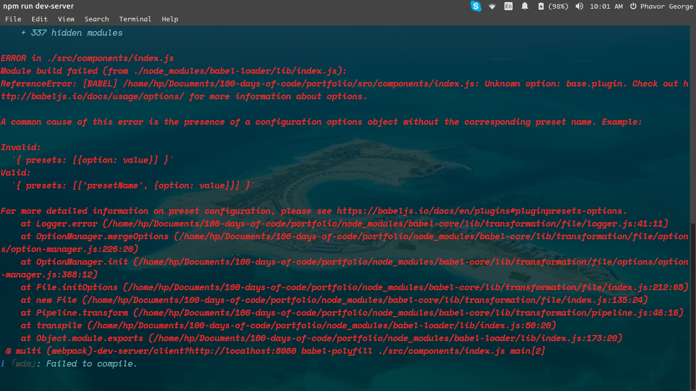

# Documentations

## Errors and Their solutions

### Day9, August 9, 2018

Today I solved the `webpack.config.js` error that prevented my portfolio app from running since **Day1**

Here is the error `webpack.config.js` file:

```js
const path = require("path");

module.exports = {
  entry: ["babel-polyfill", "./src/components/index.js"],
  output: {
    path: path.resolve(__dirname, "public/scripts"),
    filename: "bundle.js"
  },
  module: {
    rules: [
      {
        test: /\.js$/,
        exclude: /node_modules/,
        use: {
          loader: "babel-loader",
          options: {
            presets: ["env"],
            plugin: ['transform-object-rest-spread']
          }
        }
      }
    ]
  },
  devServer: {
    contentBase: path.resolve(__dirname, "public"),
    publicPath: "/scripts/"
  },
  devtool: "source-map"
};
```

Because of this file I ran into this error at my console:



## __This is how I solved it__

I changed the `plugin` to `plugins` and it worked.

```js
...
options: {
  presets: ["env"],
  plugins: ['transform-object-rest-spread']
}
```

_Thanks to `@Maarten` and `@sven` in the babeljs gitter room._

### Day13 August 13, Monday

For the past two days I've been having issues making my background image display. This was after I introduced `sass` into the mix.

I went online to find help and it was really proving futile.

> This is the error code:

```css
.container__header {
  background-color: $header-bng;
  background: url('../../../public/images/header-bng/bng1.jpg'); /* this line was the error */
  background-position: center center;
  background-repeat: no-repeat;
  background-size: cover;
  color: $color;
  height: $screen;
}
```

> All I need to do was this:

`background: url('/images/header-bng/bng1.jpg')`

## Understanding the root

Webpack after bundling all files serves one file from the root. The root is the `public` dir in most cases. In my case, I was trying to access some directories outside the root which webpack could not find and thus the images would not load.

Thanks to `Nicolas Marcora` from [codingblocks](https://codingblocks.slack.com/) on slack for his insigthful help.

## Open-source contributions

When you think of open source contribution, it's very exiciting and yet very intimidating. I kinda like the mix though.

So meteor is a kind of framework built on top of javascript, and there is fluxRouter, with very clean and nice syntax. Once you think of advancing your coding vocabularies, there are always a ton of choices to pick from.
