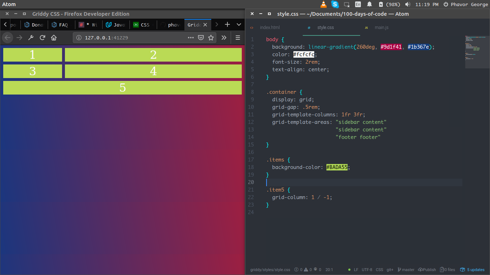
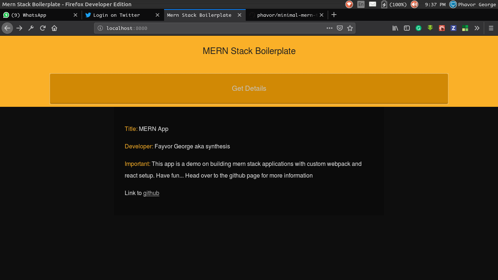
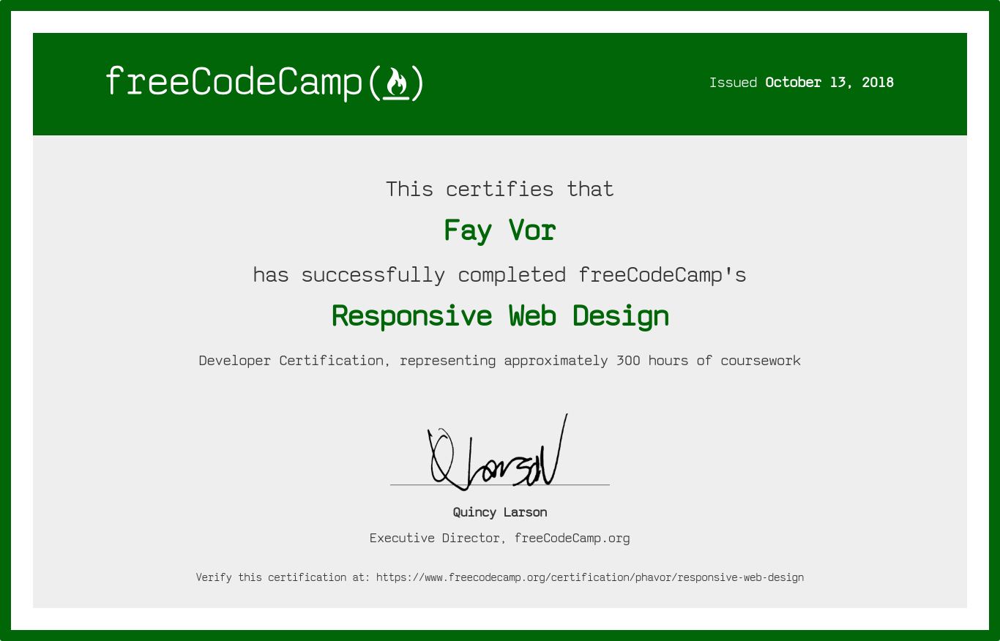

# #100daysofcode

## Quitting is for the feeble mind

### Day0 July 31, Tuesday

**Today's Work**: Started work on the portfolio app. Mostly scaffolding.

**Thoughts**: Am really wondering why I had to take this challenge.

**Link to work**: [Portfolio Site](https://github.com/phavor/100-days-of-code-fayvor/tree/master/portfolio)

### Day1 August 1, Wednesday

**Today's Work**: Today seem to be quite a day. I made some additions to the portfolio project then I setup the Kiddies-CodeCamp

**Thoughts**: I really love teaching... tech, coding, and it's fun when you have to show the light to kids and help them learn coding

**Link to work**: [Portfolio Site](https://github.com/phavor/100-days-of-code-fayvor/tree/master/portfolio), [Kiddies-CodeCamp](https://github.com/phavor/100-days-of-code-fayvor/tree/master/kiddies-codeCamp)

### Day2 August 2, Thursday

**Today's Work**: Trying to fix `node_module`'s inclusion to git tracked files. Had quite a trouble with that.

**Thoughts**: I don't have data, a collegue of mine said `data is life` now i totally agree.

**Link to work**: [Portfolio Site](https://github.com/phavor/100-days-of-code-fayvor/tree/master/portfolio)

### Day3 August 3, Friday

**Today's Work**: Really spent sometime looking at some FCC challenges

**Thoughts**: A lot has been running through my mind, propably because of tidious work

**Link to work**: [FreeCodeCamp](https://freecodecamp.org)

### Day4 August 4, Saturday

**Today's Work**: Continued with FCC challenges

**Thoughts**: Have been on transit and some public transport services are really whack. I think am going to use technology to bring some improvements

**Link to work**: [FreeCodeCamp](https://freecodecamp.org)

### Day5 August 5, Sunday

**Today's Work**: Continued work on my portfolio project and had a little lesson session with FCC

**Thoughts**: I encoutered a bug with FCC Visual aid class which demanded I put a `
` tag in a portion of the code. I did all things possible but wouldn't pass the test. I wondered why, not untill I asked a question in the community room.

**Link to work**: [FreeCodeCamp](https://freecodecamp.org), [Portfolio Site](https://github.com/phavor/100-days-of-code-fayvor/tree/master/portfolio)

### Day6 August 6, Monday

**Today's Work**: Made some progress with [FCC](https://freecodecamp.org) **Applied Visual Design**

**Thoughts**: Today I saw a new interest with css animations. It's quite beautiful what could be achieved with `::after` and `::before` psuedo tags. Am thinking of redesigning my portfolio project. But that would come later

**Link to work**: [Blinking Heart](https://codepen.io/phavor/pen/KBBLrr?editors=0100)

### Day7 August 7, Tuesday

**Today's Work**: Continued with [FCC](https://freecodecamp.org) **Applied Accessiblity**

**Thoughts**: Think I should get some pictures to spice up the portfolio project

**Link to work**: [FCC](https://freecodecamp.org)

### Day8 August 8, Wednesday

**Today's Work**: Finished FCC class with Flexbox and Responisve Desing. Then tackled the tribute page project.

**Thoughts**: I fell in love with flexbox today while learning from FCC.

**Link to work**: [Codepen - Tribute page](https://codepen.io/phavor/full/JBmVWr/)

### Day9 August 9, Thursday

**Today's Work**: Reading through documentations on github

**Thoughts**: I really want to use sass for my styling of the portfolio page

**Link to work**: [Portfolio Site](https://github.com/phavor/100-days-of-code-fayvor/tree/master/portfolio)

### Day10 August 10, Friday

**Today's Work**: Added the `sass` support to the portfolio project

**Thoughts**: Am trying to use `sass` and not `scss`, can't figure out the __test__ `regex` rule for that. Am currently writting `/\.s?css&/`

**Link to work**: [Portfolio Site](https://github.com/phavor/100-days-of-code-fayvor/tree/master/portfolio)

### Day11 August 11, Saturday

**Today's Work**: Reading maintainable javascript by **Zakas**

**Thoughts**: Helpful book that has taught me about structuring my code and it's relevance to working in a big team.

**Link to work**: You could google `maintainable javascript`

### Day12 August 12, Sunday

**Today's Work**: Made so tidying up on my portfolio site.

**Thoughts**: Am not really getting the flow of webpack configurations, sass and using images with sass.

**Link to work**: [Portfolio Site](https://github.com/phavor/100-days-of-code-fayvor/tree/master/portfolio)

### Day13 August 13, Monday

**Today's Work**: Working on Flexbox

**Thoughts**: Flexbox is a bae. Am so in love with it.

**Link to work**: [Flexbox Froggy](www.flexboxfroggy.com)

### Day14 August 14, Tuesday

**Today's Work**: Working on FCC Second Project

**Thoughts**: I should really stick with styling the whole page with flexbox, but is that really possible?

**Link to work**: [Survery Form: Say your mind](https://codepen.io/phavor/full/JBmgNr/)

### Day15 August 15, Wednesday

**Today's Work**: Working of webpack bundling

**Thoughts**: Webpack bundles are quite an exicting thing.

**Link to Work**: [webpack](www.webpack.com)

### Day16 August 16, Thursday

**Today's Work**: Reading Development with Backbone.js

**Thoughts**: MVC and MVP is quite a scary concept to me. But a no-scared version of me is going on with this adventure

**Link to work**: You should try googling this book

### Day17 August 17, Friday

**Today's Work**: Continued with Development with Backbone.js

**Thoughts**: Am trying to interface with the concept of `model`, `views` and `controls`

**Link to work**: Haven't you googled the book yet?

### Day18 August 18, Saturday

**Today's Work**: Did some FCC work Today

**Thoughts**: I've so been away for a camping, have barely written much code this weekend. Can't wait to get back home and get coding...

**Link to work**: [FCC](https://freecodecamp.org)

---

THERE HAS BEEN A WEEK BREAK OWING TO MY ILL HEALTH THAT STARTED EARLY SUNDAY BEEN THE 19TH OF AUGUST. THIS ENDED BY THE THE 26TH OF AUGUST BEEN THE DAY I HAD ENOUGH RELIEF TO GET BACK TO WORK.

---

### Day19 August 27, Monday

**Today's Work**: Did some FCC work Today

**Thoughts**: I have been so sick since the past week and so I could not even look into my laptop screens. Health is wealth has never been this clear to me.

**Link to work**: [FCC](https://freecodecamp.org)

### Day20 August 28, Tuesday

**Today's Work**: Did some FCC work Today

**Thoughts**: I have been so sick since the past week and so I could not even look into my laptop screens. Health is wealth has never been this clear to me.

**Link to work**: [FCC](https://freecodecamp.org)

### Day21 August 29, Wednesday

**Today's Work**: Took down some challenges at [Hackerrank](https://hackerrank.com)

**Thoughts**: Feels like time is not enough. Office work is really firesome now with a lot of deadlines

**Link to work**: [Hackerrank](https://hackerrank.com) my profile? Nah...

### Day22 August 30, Thursday

**Today's Work**: Went through some udacity courses. DOM manipulations

**Thoughts**: Am taking sneek peeps into this course, my free time is no time at all right now.

**Link to work**: [Udacity](https://udacity.com)

### Day23 August 31, Friday

**Today's Work**: Continuing my course with udacity's Intro to DOM manipulations.

With concepts like:

- `addEventListener()` method
- `removeEventListener()` this takes exact `type`, `listener fn` and `phase`.
- Event Delegation. That allows for managing multiple events with one listener.

**Thoughts**: It feels cool knowing more about the `element node` and it's properties.

**Link to work**: [Udacity](https://udacity.com)

### Day24 September 1, Saturday

**Today's Work**: Still on udacity's course. Learnt a few new concepts.

Concepts like listening for

- `DOMContentsLoaded` allows you to put some scripts in the head section of the HTML file and it won't throw any error.

Today I also started looking briefly at CSS Grids and I saw some video materials from WesBos's [CSS Griddy](https://cssgriddy.io)

**Thoughts**: Now I know why I see some framework scripts being inserted in the head section of some sites that use them. I've been wondering what's so cool about this css grid moxilla always talks about, now I see why it's so sweet. You could totally layout a complete website with it. It though has close functionalities with the css Flexbox

So I think of laying out something really simple like this 

**Link to work**: [Udacity](https://udacity.com)

### Day25 September 2, Sunday

**Today's Work**: Had some time working on CSS Grids from yesterday's lessons.

**Thoughts**: For the sake of simplicity which is better? CSS Flexbox or Grids?

**Link to work**: Could you find a way to get to my system locally?

### Day26 September 3, Monday

**Today's Work**: This is the day I finish my class with udacity and get done with this DOM stuff.

**Thoughts**: There are a couple of things on my mind, well at this moment I can only think of finishing what I've started.

**Link to work**: [Udacity](https://udacity.com)

### Day27 September 4, Tuesday

**Today's Work**: Still hanging out with udacity. Though not much was done today because of light

**Thoughts**: Actually sad and angry with the power supply companies over here.

**Link to work**: You should visit udacity's site and checkout their courses.

### Day28 September 5, Wednesday

**Today's Work**: Went through some medium articles on Algorithm and Data Structure.

**Thoughts**: When you don't have power supply, you are restricted to very minimal things. I choose to be optimistic though.

**Link to work**: Medium is a nice place to be.

### Day29 September 6, Thursday

**Today's Work**: Get on with form validation.

**Thoughts**: React form validation has got me restless. I must have to get a hold on it.

**Link to work**: [form-validation](https://github.com/phavor/100-days-of-code-fayvor/tree/master/form-validations/FV-1)

### Day30 September 7, Friday

**Today's Work**: Styled the Form Page

**Thoughts**: I could try doing reacts kind of validation with just HTML and JS

**Link to work**: [form-validation](https://github.com/phavor/100-days-of-code-fayvor/tree/master/form-validations/FV-1)

### Day31 September 8, Saturday

**Today's Work**: Get input from form elements and update the user object accordingly

**Thoughts**: Tried validating forms like `react` does and boy it's quite fun.

**Link to work**: [form-validation](https://github.com/phavor/100-days-of-code-fayvor/tree/master/form-validations/FV-1)

### Day32 September 9, Sunday

**Today's Work**: Getting the `Product page` project done at FCC

**Thoughts**: It's gonna be a short night... I have to be as fast as the `javascript` engine

**Link to work**: [Product Page](https://codepen.io/phavor/full/bjyNQY/)

### Day33 September 10, Monday

**Today's Work**: Haven't really finished with the product app... office workload has trippled

**Thoughts**: When working on something, passion has proved to be the sole `return` value for me.

**Link to work**: [Product Page](https://codepen.io/phavor/full/bjyNQY/)

### Day33 September 11, Tuesday

**Today's Work**: Continuing with the product app project from FCC

**Thoughts**: Bugs are annoying but and yet so interesting.

**Link to work**: [Product Page](https://codepen.io/phavor/full/bjyNQY/)

### Day34 September 12, Wednesday

**Today's Work**: Worked on UI designs of the product page from FCC

**Thoughts**: It's pretty cool that I can write `@media (max-width: 640px)` within any selector of my choice.

**Link to work**: [Product Page](https://codepen.io/phavor/full/bjyNQY/)

### Day35 September 13, Thursday

**Today's Work**: Finished up the UI and Mobile responsiveness on the product page FCC project

**Thoughts**: It's quite fun working with `@media ()` queries.

**Link to work**: [Product Page](https://codepen.io/phavor/full/bjyNQY/)

### Day36 September 14, Friday

**Today's Work**: Today was spent with `Tania Rascia` learning the basics of TDD with `mocha` and we built a simple `command line interface` calculator.

**Thoughts**: Tania has a very simple way of making scary topics simple and approachable.

**Link to work**: [Cli-Calc](https://github.com/phavor/100-days-of-code-fayvor/tree/master/cli-calc)

### Day37 September 15, Saturday

**Today's Work**: Finished with `Tania Rascia` lesson on CLI Node.js calculator.

**Thoughts**: TDD and unit testing is quite fun.

**Link to work**: [Cli-Calc](https://github.com/phavor/100-days-of-code-fayvor/tree/master/cli-calc)

### Day38 September 16, Sunday

**Today's Work**: Finished with CSS-GRIDs at `freecode Camp`

**Thoughts**: I see how easy it could be to build responsive layouts with `grids`. I gotta learn them.

**Link to work**: [freecode Camp](https://freecodecamp.org)

### Day39 September 17, Monday

**Today's Work**: Took a peek into MetoerJS

**Thoughts**: Quite fascinating when you think of contributing to open source projects

**Link to work**: [codebuddies](https://codebuddies.org)

### Day40 September 18, Tuesday

**Today's Work**: Took a peek into Google Cloud Platform and APIs

**Thoughts**: This has got my mind so buggled and troubled. I really don't understand a thing here yet.

**Link to work**: [Google Cloud Platform](https://developers.google.com/maps/documentation/javascript/get-api-key?hl=en_US#key-restrictions)

### Day41 September 19, Wednesday

**Today's Work**: Playing around with APIs.

**Thoughts**: API is quite fun and troubling

**Link to work**: [Google Cloud Platform](https://developers.google.com/maps/documentation/javascript/get-api-key?hl=en_US#key-restrictions)

### Day42 September 20, Thursday

**Today's Work**: Reading Docs

**Thoughts**: Reading is becoming fun for me.

**Link to work**: No links just reading.

### Day43 September 21, Friday

**Today's Work**: Implementing Authentication and Authorization

**Thoughts**: node is quite a bit

**Link to work**: [Quest](https://github.com/phavor/quest)

### Day44 September 22, Saturday

**Today's Work**: Reading about the pitfalls of using the browser's `localStorage` to save sensitive data like `jwt token`

**Thoughts**: I never like using `localStorage` to save `jwt` and thus I had to find an answer to this security risk

**Link to work**: [Don't do this...](https://dev.to/rdegges/please-stop-using-local-storage-1i04)

### Day45 September 23, Sunday

**Today's Work**: There has not been light since I returned from church. I just have to read coding articles online with my phone.

**Thoughts**: It's pretty damming that these power holding companies here are so callous and heartless.

**Lint to work**: There's actually none. Been reading a cross section of materials

### Day46 September 24, Monday

**Today's Work**: Have been reading through the `redux` documentation. Quite simple and explanatory.

**Thoughts**: Am wondering which is better, Reacts context API or redux?

**Lint to work**: [Redux Docs](https://redux.js.org)

### Day47 September 25, Tuesday

**Today's Work**: Installed redux and setup for the project.

**Thoughts**: Redux happens to be a very interesting source of relief from state management nightmares.

**Link to work**: [Redux Docs](https://redux.js.org)

### Day48 September 26, Wednesday

**Today's Work**: Worked on context API today

**Thoughts**: It takes persistence and time to get to the destination you see.

**Link to work**: [Code Sandbox](https://mq2z9nmq5p.codesandbox.io/)

### Day49 September 27, Thursday

**Today's Work**: Continued work on context API today

**Thoughts**: Cant set my mind on something right. Am just so borthered

**Link to work**: [Code Sandbox](https://mq2z9nmq5p.codesandbox.io/)

### Day50 September 28, Friday

**Today's Work**: Setup my MERN App boilerplate with custom react config

**Thoughts**: A happy mind creates happy results

**Link to work**: [Mern Custom Config](https://github.com/phavor/minimal-mern-template)

### Day51 September 29, Saturday

**Today's Work**: Finished with client side setup

**Thoughts**: So annoying when you don't have light to work with.

**Link to work**: [Mern Custom Config](https://github.com/phavor/minimal-mern-template)

### Day52 September 30, Sunday

**Today's Work**: Finished with setting up a custom boilerplate for a mern stack application.

**Thoughts**: This was quite a challenge, especially with the eslint setup part. I had fun though learning a lot through the process. _I think am going to make an article on this._

**Link to work**: [Mern Custom Config](https://github.com/phavor/minimal-mern-template)

### Day53 October 1, Monday

**Today's Work**: Took a postgresql opensource project in the spirit of #hacktoberfest

**Thoughts**: Evasive of the fact that I need a polo swag or something

**Link to work**: [Cartale_api](https://github.com/tibetegya/Cartale_api)

### Day54 October 2, Tuesday

**Today's Work**: Setup a descriptive readme file

**Thoughts**: Opensource is bae

**Link to work**: [Cartale_api](https://github.com/tibetegya/Cartale_api)

### Day55 October 3, Wednesday

**Today's Work**: Setup server for the Api manipulations

**Thoughts**: Postgresql is beating me around ooo

**Link to work**: [Cartale_api](https://github.com/tibetegya/Cartale_api)

### Day56 October 4, Thursday

**Today's Work**: Setup NumGuess game for Kids

**Thoughts**: I would really love to animate this and help the kids get more engaged. Inspiration needed

**Link to work**: [Number Guesser](https://github.com/phavor/100-days-of-code-fayvor/tree/master/NumGuess)

### Day57 October 5, Friday

**Today's Work**: Finish up with styling of the game.

**Thoughts**: Still in need of inspiration.

**Link to work**: [Number Guesser](https://github.com/phavor/100-days-of-code-fayvor/tree/master/NumGuess)

### Day58 October 6, Saturday

**Today's Work**: Start game logics for `Number Guess`

**Thoughts**: In need of harmony. Letting go of so much worries at this point.

**Link to work**: [Number Guesser](https://github.com/phavor/100-days-of-code-fayvor/tree/master/NumGuess)

### Day59 October 7, Sunday

**Today's Work**: Add asthetics to the game and continue building the logic

**Thoughts**: There is no victory in shame.

**Link to work**: [Number Guesser](https://github.com/phavor/100-days-of-code-fayvor/tree/master/NumGuess)

### Day60 October 8, Monday

**Today's Work**: Finished with Number guess MVP-0

**Thoughts**: Quite a lot to do and you literally have no time.

**Link to work**: [Number Guesser](https://github.com/phavor/100-days-of-code-fayvor/tree/master/NumGuess)

### Day61 October 9, Tuesday

**Today's Work**: Kickoff with Questionify

**Thoughts**: Let's get handy with node and CRUD

**Link to work**: [Questionify](https://github.com/phavor/questionify)

### Day62 October 10, Wednesday

**Today's Work**: Add Question routes

**Thoughts**: A day of raging thoughts... can you really code efficiently with anger boiling within your mind?

**Link to work**: [Questionify](https://github.com/phavor/questionify)

### Day63 October 11, Thursday

**Today's Work**: Technical Documentation on FCC

**Thoughts**: Been a long while coming, I thought I should get closer to my first FCC certification.

**Link to work**: [Codepen](https://codepen.io/phavor/full/pOOVwK/)

### Day64 October 12, Friday

**Today's Work**: Continue to develope the QnA endpoints

**Thoughts**: Cracked the most annoying bug I've ever had while working with servers.

**Link to work**: [Questionify](https://github.com/phavor/questionify)

### Day65 October 13, Saturday

**Today's Work**: Build a portfolio page

**Thoughts**: Got my first FCC certication today. It's so exciting

**Link to work**: [Codepen](https://codepen.io/phavor/full/mzBVWp/)

### Day66 October 14, Sunday

**Today's Work**: Learning AJAX from Udacity

**Thoughts**: Nothing good comes easy. You dont quit because there's a goal, but because you are thte goal.

**Link to work**: [Udacity](https://udacity.com)

### Day67 October 15, Monday

**Today's Work**: Finished with FCC's Basic Javascript and did a bit of node_jwt_auth.

**Thoughts**: The best is in the test

**Link to work**: FCC all the way.

### Day68 October 16, Tuesday

**Today's Work**: Teaching kids to code

**Thoughts**: It's so much fun seeing kids so exicted learning to code the web

**Link to work**: Chill shaa... I will show you pictures

### Day69 October 17, Wednesday

**Today's Work**: Contributing to OS at [Hacktoberfestinaba](https://github.com/hacktoberfestinaba)

**Thoughts**: I actually love the act of code review, though I wonder how it's possible to picture contributes code in the browser... uploading a screenshot comes to mind.

**Link to work**: [Hacktoberfestinaba](https://github.com/HacktoberfestinAba/HacktoberfestinAba.github.io)

### Day70 October 18, Thursday

**Today's Work**: Continued Contributions to OS at [Hacktoberfestinaba](https://github.com/hacktoberfestinaba)

**Thoughts**: Building a community is like building friendship, you have to be ready to communicate

**Link to work**: [Hacktoberfestinaba](https://github.com/HacktoberfestinAba/HacktoberfestinAba.github.io)

### Day71 October 19, Friday

**Today's Work**: Started work on naijaHacks2018 project with my teammates

**Thoughts**: What could we build to win 1 million naira. I seriously wondered if we could pull this off. But faith is what I have, we must try even if we fail.

**Link to work**: [naijaHacks-TeamSpread](https://github.com/naijahacks-TeamSpread)

### Day72 October 20, Saturday

**Today's Work**: Started course schema for our naijaHacks project

**Thoughts**: You must believe in the impossible to be successful.

**Link to work**: [naijaHacks-TeamSpread](https://github.com/naijahacks-TeamSpread)

### Day73 October 21, Sunday

**Today's Work**: Tried logging in new users, but it's been failing.

**Thoughts**: This laptop has no respect for feelings. The way it's hanging can just kill a man.

**Link to work**: [naijaHacks-TeamSpread](https://github.com/naijahacks-TeamSpread)

### Day74 October 22, Monday

**Today's Work**: Finished an Image upload project using multer

**Thoughts**: It's amazing how helpful documentations are. I wonder why new / intermediate devs dont find it interesting.

**Link to work**: [Image-Upload-Manager](https://github.com/phavor/Image-Upload-Manager)

### Day75 October 23, Tuesday

**Today's Work**: Continued working on the naijahacks project.

**Thoughts**: I should be in lagos for this event though.

**Link to work**: [naijaHacks-TeamSpread](https://github.com/naijahacks-TeamSpread)

### Day76 October 24, Wednesday

**Today's Work**: Started styling crea8lab project

**Thoughts**: Am thinking I should OS this project.

**Link to work**: [Crea8lab](https://crea8lab.github.io/)

### Day77 October 25, Thursday

**Today's Work**: Ensured mobile responsiveness of the header

**Thoughts**: Am thinking I should OS this project.

**Link to work**: [Crea8lab](https://crea8lab.github.io/)

### Day78 October 26, Friday

**Today's Work**: Finally OS'd this project and it's working out fine

**Thoughts**: I have exceed requirements for getting my Hacktoberfest T-shirt, I should help my mates get theirs

**Link to work**: [Crea8lab](https://crea8lab.github.io/) goto the repo [here](https://github.com/crea8lab/crea8lab.github.io)

### Day79 October 27, Saturday

**Today's Work**: Working on code review for the crea8lab project

**Thoughts**: Reviewing code and ensuring that standards are followed takes time, patience and a lot of community work on the reviewers part.

**Link to work**: [Crea8lab](https://crea8lab.github.io/) goto the repo [here](https://github.com/crea8lab/crea8lab.github.io)

### Day80 October 28, Sunday

**Today's Work**: Continued work on Crea8lab

**Thoughts**: I have to start my blogpost where I write this articles in my head.

**Link to work**: [Crea8lab](https://crea8lab.github.io/) -  goto the repo [here](https://github.com/crea8lab/crea8lab.github.io)

### Day81 October 29, Monday

**Today's Work**: Continued work on Crea8lab

**Thoughts**: After this hacktoberfest I really have to get deeper into open sourcing and community things

**Link to work**: [Crea8lab](https://crea8lab.github.io/) -  goto the repo [here](https://github.com/crea8lab/crea8lab.github.io)

### Day82 October 30, Tuesday

**Today's Work**: Merged the projects page worked on by __Mac Anthony__

**Thoughts**: It's fulfilling when progress is the order of the day.

**Link to work**: [Crea8lab](https://crea8lab.github.io/) -  goto the repo [here](https://github.com/crea8lab/crea8lab.github.io)

### Day83 October 31, Wednesday

**Today's Work**: Spent some time with my IT report and logbook

**Thoughts**: I accepted a work today

**Link to work**: 👍

### Day84 November 1, Thursday

**Today's Work**: Bought a new system, and setting up linux. Meanwhile I did some code review today.

**Thoughts**: Nothing is better than a free mind.

**Link to work**: 👍

### Day85 November 2, Friday

**Today's Work**: Finished installing ubuntu and manjaro on my new system.

**Thoughts**: Set to do some real work.

**Link to work**: 👍

### Day86 November 3, Saturday

**Today's Work**: Read professional bash scripting from [goalkicker.com](https://goalkicker.com)

**Thoughts**: Understanding the basics of linux is paramount to programming success

**Link to work**: [goalkicker.com](https://goalkicker.com)

### Day87 November 4, Sunday

**Today's Work**: Read more on professional bash scripting from [goalkicker.com](https://goalkicker.com)

**Thoughts**: What would it take to be a hacker?

**Link to work**: [goalkicker.com](https://goalkicker.com)

### Day88 November 5, Monday

**Today's work**: Go live with MERN article

**Thoughts**: I have to take my writting skills to the next level.

**Link to work**: [Creating MERN boilerplate](https://medium.com/ignyte/create-a-mern-app-boilerplate-a2487d336e87)

### Day89 November 6, Tuesday

**Today's Work**: Take up some challenges on fCC

**Thoughts**: I need to finish up my 100DaysOfCode with atleast 2 certifications

**Link to work**: [FCC](https://freecodecamp.org)

### Day90 November 7, Wednesday

**Today's Work**: Finised Regex course on FCC

**Thoughts**: I love the way FCC teaches the almighty scary regex.

**Link to work**: [FCC](https://freecodecamp.org)

### Day91 November 8, Tursday

**Today's Work**: Worked on Debugging project from FCC

**Thoughts**: Now things are looking up

**Link to work**: [FCC](https://freecodecamp.org)

### Day92 November 9, Friday

**Today's Work**: Went to Genesis to have some fun with the team

**Thoughts**: Not ready for some jokes now.

**Link to work**: Just chill for a sec.

### Day93 November 10, Saturday

**Today's Work**: Went to Genesis to have some fun with the team

**Thoughts**: Not ready for some jokes now.

**Link to work**: Just chill for a sec.

### Day94 November 11, Sunday

**Today's Work**: Continued with Basic algorithm at FCC

**Thoughts**: Building a community is bugging me like this.

**Link to work**: [FCC](https://freecodecamp.org) 